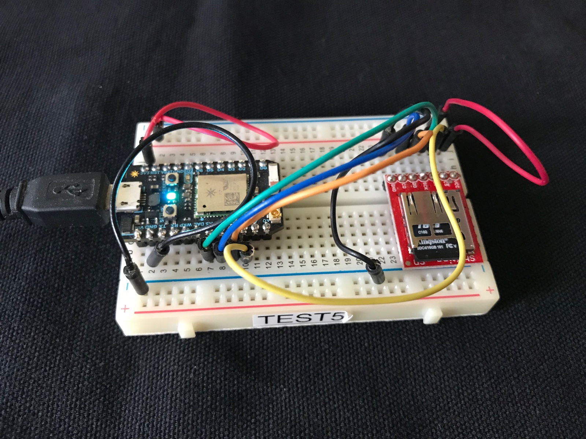

# Uploader sample app

This is a very simple proof-of-concept for upload files from an SD card. It's not intended to be a fully production-ready, but illustrates the basic concepts.



## The Code

The main program is uploader1.cpp in the src directory.

It uses the code in HttpPostSD.cpp and HttpPostSD.h 

Be sure to edit the server hostname and port in the uploader1.cpp file.

### To build

You can build it using the Particle CLI, by using cd to move into the uploader directory (where project.properties is) and executing something like: 

```
particle compile photon . --saveTo firmware.bin
```

It should also build for Electron.


## Server

There's a simple example server written in node.js for testing in the server directory.

To install the dependencies:

```
npm install
```

To run it:

```
npm start
```

